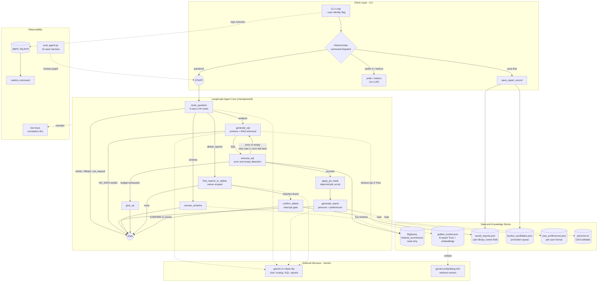

```mermaid
flowchart TB
    subgraph CLIENT["Client Layer - CLI"]
        CLI["CLI Loop<br/>--user identity flag"]
        CMD{"Deterministic<br/>command dispatch"}
        CLI --> CMD
        CMD -->|"save that"| SAVE["save_report_record"]
        CMD -->|"prefer X / metrics"| LOCAL["prefs / metrics<br/>(no LLM)"]
        CMD -->|questions| GRAPH_IN
    end

    subgraph AGENT["LangGraph Agent Core (checkpointed)"]
        GRAPH_IN(("START"))
        ROUTER["route_question<br/>6-way LLM router"]
        GENSQL["generate_sql<br/>schema + RAG-informed"]
        EXEC["execute_sql<br/>error and empty detection"]
        MASK["apply_pii_mask<br/>deterministic scrub"]
        REPORT["generate_report<br/>persona + preferences"]
        SCHEMA_N["answer_schema"]
        GIVEUP["give_up"]
        FINDDEL["find_reports_to_delete<br/>owner-scoped"]
        CONFIRM["confirm_delete<br/>interrupt gate"]

        GRAPH_IN --> ROUTER
        ROUTER -->|analysis| GENSQL
        ROUTER -->|schema| SCHEMA_N
        ROUTER -->|"clarify / offtopic / pii_request"| OUT(("END"))
        ROUTER -->|delete_reports| FINDDEL
        GENSQL -->|SQL| EXEC
        GENSQL -->|NO_DATA verdict| OUT
        EXEC -->|"error or empty<br/>retry max 2, error fed back"| GENSQL
        EXEC -->|"budget exhausted"| GIVEUP
        EXEC -->|success| MASK
        MASK --> REPORT
        REPORT --> OUT
        SCHEMA_N --> OUT
        GIVEUP --> OUT
        FINDDEL -->|matches found| CONFIRM
        FINDDEL -->|none| OUT
        CONFIRM -->|"CONFIRM or cancel"| OUT
    end

    subgraph STORES["Data and Knowledge Stores"]
        BQ[("BigQuery<br/>thelook_ecommerce<br/>read-only")]
        BUCKET[("golden_bucket.json<br/>8 expert Trios + embeddings")]
        REPORTS[("saved_reports.json<br/>user library, owner field")]
        CANDS[("bucket_candidates.json<br/>promotion queue")]
        PREFS[("user_preferences.json<br/>per-user format")]
        PERSONA[("persona.txt<br/>CEO-editable")]
    end

    subgraph EXTERNAL["External Services - Gemini"]
        LLM["gemini-3.1-flash-lite<br/>chat: routing, SQL, reports"]
        EMB["gemini-embedding-001<br/>retrieval vectors"]
    end

    subgraph OBS["Observability"]
        TRACE["live trace<br/>correlation IDs"]
        LOG[("agent_log.jsonl")]
        METRICS["metrics command"]
        EVAL["eval_agent.py<br/>10-case harness"]
    end

    GENSQL -.retrieve top-3 Trios.-> BUCKET
    GENSQL -.-> LLM
    ROUTER -.-> LLM
    REPORT -.-> LLM
    FINDDEL -.-> LLM
    BUCKET -.embed.-> EMB
    EXEC --> BQ
    SCHEMA_N -.live schema.-> BQ
    REPORT -.load.-> PERSONA
    REPORT -.load.-> PREFS
    SAVE --> REPORTS
    SAVE --> CANDS
    CONFIRM --> REPORTS
    AGENT -.narrates.-> TRACE
    CLI -.logs outcome.-> LOG
    LOG --> METRICS
    EVAL -.invokes graph.-> GRAPH_IN
```