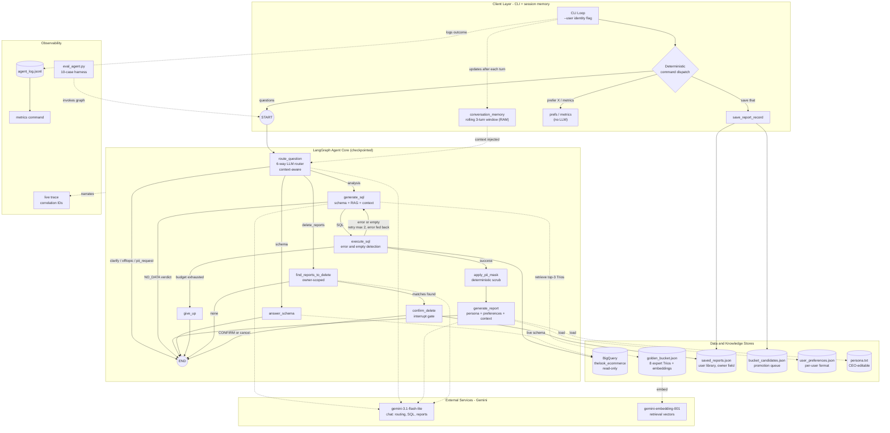

# Retail Data Agent

An AI data analyst for non-technical retail executives. Ask questions in plain
English; the agent writes BigQuery SQL informed by expert examples, self-heals
failed queries, masks PII deterministically, and returns analyst-style reports —
with human confirmation gating any destructive action.

Built with **LangGraph + Gemini + BigQuery** against the public
`thelook_ecommerce` dataset.


## Quick start

### Prerequisites
- Python 3.11+
- A Google Cloud project with the BigQuery API enabled (free tier is sufficient)
- The [gcloud CLI](https://cloud.google.com/sdk/docs/install)
- A Gemini API key from [Google AI Studio](https://aistudio.google.com) (free)

### Setup
```bash
git clone https://github.com/Sirneyo/retail-data-agent.git
cd retail-data-agent

# Virtual environment
python -m venv .venv
.\.venv\Scripts\activate        # Windows
# source .venv/bin/activate     # Mac/Linux

python -m pip install -r requirements.txt

# Google Cloud auth (one-time)
gcloud auth application-default login
gcloud config set project YOUR_PROJECT_ID
gcloud auth application-default set-quota-project YOUR_PROJECT_ID
```

Create a `.env` file in the project root:
```
GOOGLE_API_KEY=your_gemini_api_key
GCP_PROJECT_ID=your_gcp_project_id
```

### Verify your setup
```bash
python connection_test.py
# Expect: "BigQuery OK — orders rows: ..." and "Gemini OK — ready"
```

### Run the agent
```bash
python agent.py                     # default user (manager_a)
python agent.py --user manager_b    # as a different user
python agent.py --quiet             # without the live trace
```

## Using the agent

| You type | What happens |
|---|---|
| any data question | routed → SQL → BigQuery → PII mask → analyst report |
| a follow-up ("what about by units?") | resolved against the conversation window |
| `save that` | saves last report to your library + queues a Golden Bucket candidate |
| `prefer tables` / `prefer bullets` | sets your persistent report format |
| `my preferences` | shows your stored preference |
| `delete reports mentioning X` | matches → shows exactly what → requires typing CONFIRM |
| `metrics` | agent-level dashboard from the event log |
| `exit` | quit |

**Persona:** edit `persona.txt` and the very next report speaks in the new tone —
no restart needed.

## Example session
```
(paste a fresh terminal capture here: one analysis question with trace,
one follow-up, one save, one delete-with-confirmation)
```

## Evaluation
```bash
python eval_agent.py            # 10-case harness: routing, safety, execution
python eval_agent.py --judge    # adds LLM-as-judge intent scoring
```
Current scorecard: **10/10**. Exit code is nonzero on failures (CI-gateable).

## Notes
- Results change day to day: Google continuously regenerates `thelook_ecommerce`.
- No credentials live in this repo: `.env` is gitignored; Google auth stays in
  your local gcloud profile.
- Full design rationale: see [TECHNICAL_EXPLANATION.md](TECHNICAL_EXPLANATION.md)

## Architecture diagram

